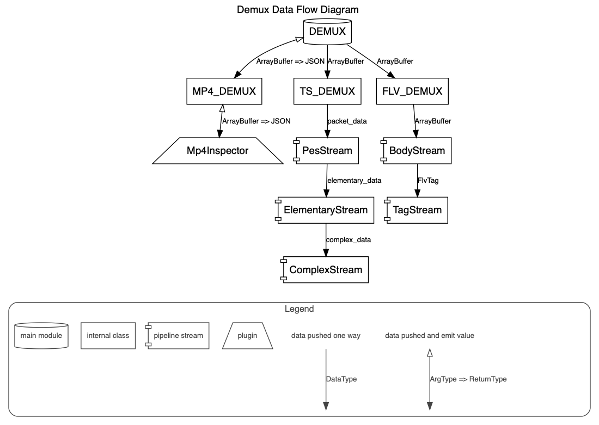

# A tool for demux ts/mp4/flv.

> This tool can be used on platforms such as HTML5 players or Node.js

[](https://www.npmjs.com/package/demuxer)
[](https://www.npmjs.com/package/demuxer)
[](https://app.travis-ci.com/goldvideo/demuxer)
[](./)

## Demos

- [Demux MP4](./doc/examples/demux-mp4.html)
- [Demux TS](./doc/examples/demux-ts.html)
- [Demux FLV](./doc/examples/demux-flv.html)

## Data flow diagram



## Feature

- Support push streaming-data to demux
- Tree-shakable (The version coded with full code does not need to worry about the reference size. When the business only refers to a certain format of decoding, the overall code supports tree-shaking)

- Any-combination packaging (These formats can be packaged according to requirements, users do not need to package all the code)

## How to start?

1. install

   ```shell
   npm i demuxer
   ```

2. Setup

   ```js
   import { TSDemux, FLVDemux, MP4Demux, Events } from 'demuxer';

   const demux = new TSDemux();
   // const demux = new FLVDemux();
   // const demux = new MP4Demux();

   // The data is spit out in a streaming manner,
   // and the first data is emitted as soon as possible.
   demux.on(Events.DEMUX_DATA, (e) => {
     console.log(e);

     // if (e.stream_type === 15) {
     //     console.log(e)
     // }
   });

   demux.on(Events.DONE, (e) => {
     // consumed & flushed all piped buffer.
   });

   // buffer -> video bytes ArrayBuffer
   demux.push(buffer, {
     // Support push part of the data for parsing
     // When done is set to true, if the data is decoded and there is no remaining data, the data is considered to have been pushed and Events.DONE will be emitted.
     // When done is set to false, Events.DONE will not be emit, waiting for subsequent data push
     done: true
   });
   ```

3. Debug

   ```$js
   var demuxer = new TSDemux({
       debug: true
   });
   ```

4. Demuxer Options

   ```$js
   let options = {
       // Setting options.debug = true; will turn on debug logs on JS console.
       debug: true
   };

   var demuxer = new TSDemux(options);
   // var demuxer = new MP4Demux(options);
   // var demuxer = new FLVDemux(options);
   ```

## About decoding MP4 raw data (h264/hevc/aac)

Developer should parse the data of the mp4 header, and then locate the pos of the data information in the mdat according to the information described in the mp4 header.

## About how to integrate Demuxer with Worker

Because the third party is likely to be internally built by the worker tool, in order not to conflict and redundancy with the worker tool, the worker is implemented by the user.

## Lang

[中文文档](./README_ZH.md)

## LICENSE

[MIT](LICENSE)

## PES采样器

我们提供了一个PES采样器工具，可以用于分析和导出TS文件中的PES包数据。

### 主要功能
- 加载TS文件并解析PES包
- 显示PES包的统计信息
- 过滤特定类型或PID的PES包
- 查看PES包的详细信息，包括PTS/DTS时间戳和原始数据
- 导出单个PES包的原始数据
- 批量导出特定类型的PES包
- 导出PES统计报告

### 使用方法
1. 打开 `doc/examples/pes-sample.html` 文件
2. 选择一个TS文件进行分析
3. 使用过滤功能查找特定类型的PES包
4. 点击PES条目查看详细信息
5. 使用导出功能保存数据

示例PES采样器支持解析以下流类型：
- H.264视频 (stream_type=27)
- HEVC视频 (stream_type=36)
- AAC音频 (stream_type=15)
- MP3音频 (stream_type=17)
- 其他流类型

### PES包结构
PES (Packetized Elementary Stream) 包是MPEG-TS传输流中的基本数据单元，包含以下信息：
- PTS (Presentation Time Stamp): 显示时间戳
- DTS (Decoding Time Stamp): 解码时间戳
- 实际音视频数据

详细信息可参考ISO/IEC 13818-1标准。
